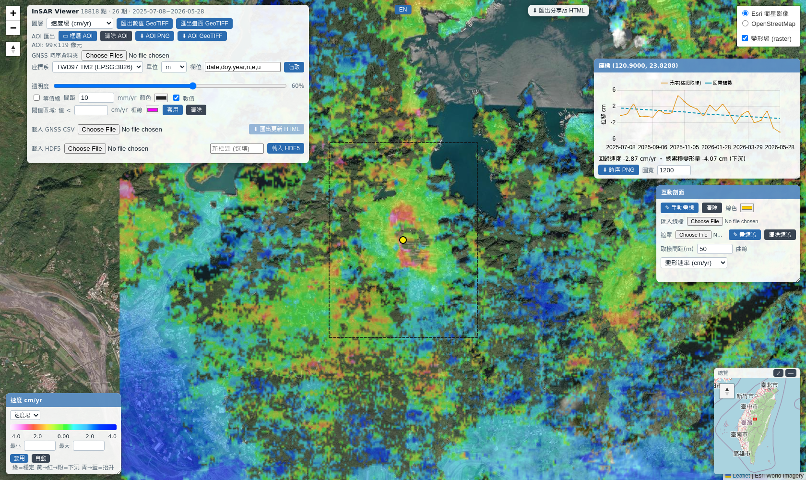
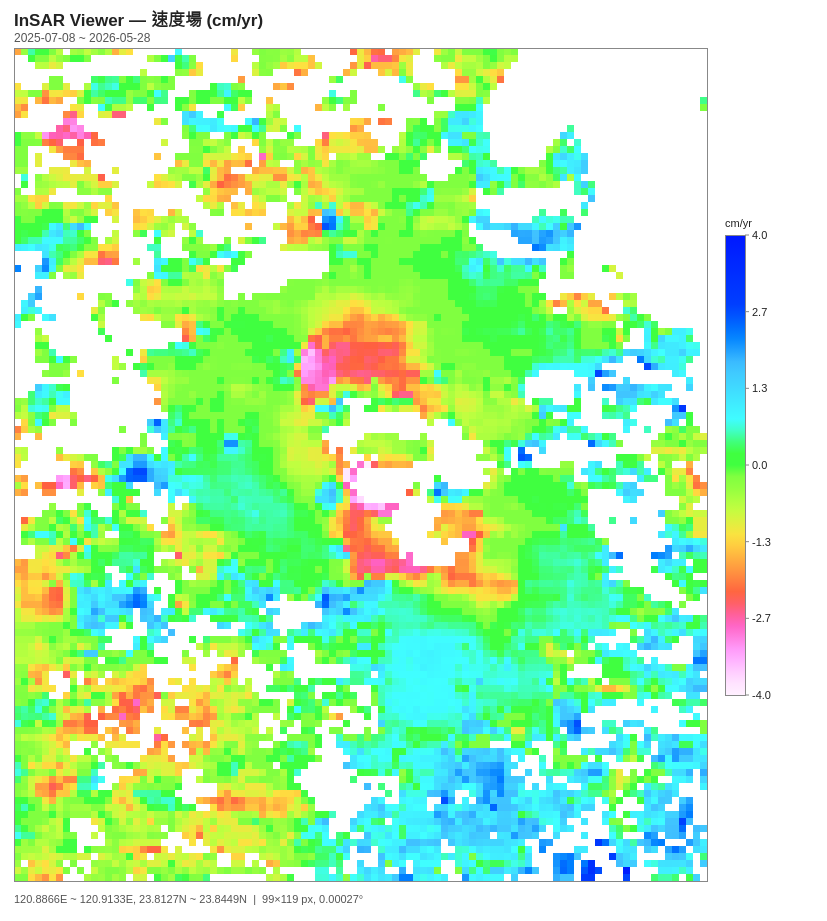
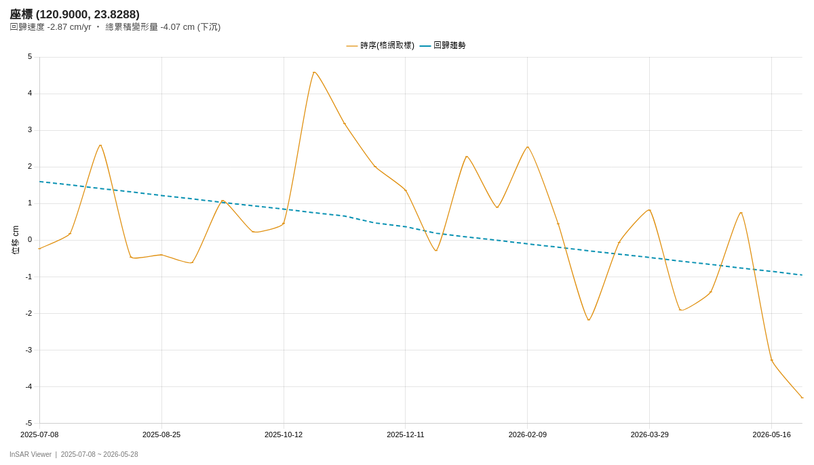

# InSAR_Viewer

單一 HTML 檔的 InSAR 時間序列檢視器。開檔後在瀏覽器內直接讀取時序資料、算速度場與累積變形、取剖面、看單點時序，並匯出 PNG／GeoTIFF／GIF。**沒有伺服器，資料不會上傳**，整份計算都在本機瀏覽器完成。

支援兩種資料來源：

- **時序 HDF5** — MintPy / dolphin 的 `timeseries*.h5`（`X_FIRST`/`Y_FIRST`/`X_STEP`/`Y_STEP`、單位 m），或 `gmtsar2h5.py` 產的 `GEOTRANSFORM` 格式（單位 mm/cm）
- **GMTSAR 時序資料夾** — `disp_NNN_ll.xy`（`lon lat 位移mm`）＋ `data_date.txt`



---

## 功能

| 分類 | 內容 |
|---|---|
| 資料來源 | 時序 HDF5（含同調性遮罩檔與門檻）／ GMTSAR 散點資料夾 |
| 前處理 | 用外部速度場逐格改寫時序趨勢、逐期線性坡面去除（deramp）、同調性門檻遮罩、顯示單位 mm/cm、色階上限 |
| 圖層 | 速度場（全期最小二乘回歸）／總累積變形量，可切換 |
| 分析 | 點擊看單點時序＋回歸速度、互動剖面（畫線／匯入 GeoJSON/SHP）、等值線、閾值面積統計、多邊形遮罩 |
| GNSS | 讀 GNSS 時序資料夾（`.xlsx`/`.csv`/`.txt`），點測站看 E/N/U 三分量與各分量速度 |
| 匯出 | AOI 範圍 PNG（colorbar 畫在圖框外）、AOI 數值 GeoTIFF（float32, EPSG:4326）、剖面播放 GIF、速率剖面 PNG、單點時序 PNG、分享版 HTML |
| 語系 | 繁體中文 / English 即時切換 |

## 快速開始

1. 下載 [`InSAR_Viewer.html`](InSAR_Viewer.html)（約 7.9 MB，已內嵌 Leaflet、Chart.js、h5wasm、SheetJS）
2. 用 Chrome 或 Edge 開啟（`file://` 直接開即可；底圖需要連網，其餘功能離線可用）
3. 在開場面板選一種資料來源，按「載入並繪圖」

## 資料來源格式

### ① 時序 HDF5

必要內容：

- 資料集 `timeseries`（或 `displacement`），形狀 `(期數, 列, 行)`
- 資料集 `date`，`YYYYMMDD` 字串，長度等於期數
- 幾何：屬性 `X_FIRST`/`Y_FIRST`/`X_STEP`/`Y_STEP`（MintPy 慣例，`Y_STEP` 為負），或屬性 `GEOTRANSFORM`（GDAL 六參數）
- 單位：屬性 `UNIT`，接受 `m`／`cm`／`mm`，內部一律換算成 mm

同調性遮罩檔為選填，二維資料集（`coherence`、`temporalCoherence`、`averageCoh`、`avgSpatialCoh` 皆可辨識），低於門檻的像元整條時序設為無資料。

**遮罩對兩種資料來源都適用**：與時序同尺寸時逐格對應；尺寸或格網不同時，只要遮罩檔本身帶地理屬性（`X_FIRST`/`Y_STEP` 或 `GEOTRANSFORM`），就依經緯度做最近鄰重取樣，落在遮罩範圍外的網格一律遮掉並在訊息中回報格數。GMTSAR 資料夾模式的網格是載入當下才決定的，所以那條路徑一定走重取樣。

### ② GMTSAR 時序資料夾

- `disp_001_ll.xy` … `disp_NNN_ll.xy`：三欄 `lon lat 位移(mm)`，各期點位不必相同
- `data_date.txt`：每列一個 `YYYYMMDD`，列數必須等於 disp 檔數

散點以等經緯格網做**格內平均**聚合。GMTSAR 沒有同調性遮罩，**有效範圍由 PS 點分布本身決定**：面板的「資料緩衝 (m)」指定容許的最大空隙，空格用該距離內的 PS 網格做反距離加權補值，超出就留白、不外插——與 `gmtsar2h5.py` 的 `--max-ps-dist-km` 同一個概念。

- 緩衝填 **0** = 完全照資料分布，只有實際落到 PS 點的網格有值
- 緩衝會被換算成整數格數，狀態列會回報實際生效的距離（例：網格 150 m、緩衝填 500 → 實際 450 m，3 格）

#### 用外部速度場校正（面板「速度場校正檔」）

原始 GMTSAR 時序常帶未校正的軌道／參考點坡面，直接算出來的速度會整體偏掉。面板可以載入一份參考速度場，逐格把時序趨勢改寫成它：`D += (v_ref − v_ols)·t`——校正後每一格的回歸速度就等於參考速度，與 `gmtsar2h5.py` 的 `--vel-geojson` 同一個做法。

- **接受格式**：GeoJSON 點檔（指定數值欄名，預設 `field_3`）或二維 HDF5 速度場（需帶 `X_FIRST`/`Y_STEP` 或 `GEOTRANSFORM`）
- **單位**：mm/yr 或 m/yr
- **坡面扣除**：可填 `C0,C1,C2,LON0,LAT0`，先從參考速度扣掉 `C0+C1·(lon−LON0)+C2·(lat−LAT0)` 再拿來校正（等同 `gmtsar2h5.py --deramp`）
- 取不到參考值的網格保持原值、不外插，狀態列回報已校正與未涵蓋的格數

實測（高雄 40 期，對照同一批資料的克利金成品）：直接載入資料夾的中位差 2.85、RMS 5.24 mm/yr；加上速度場校正後降到中位差 **0.63**、RMS **2.60** mm/yr。剩下的差異來自格網平均與克利金的空間特性，要完全一致仍請走 `gmtsar2h5.py`（差 0.01 mm/yr）。

> **這是快視模式，不是克利金。** 各期點位不同，落在同一格的 PS 點在不同期可能是不同的點；PS 稀疏處（一格只有 1 個點）的單點時序雜訊可達數十 mm，回歸速度與累積量可能互相矛盾。正式成果請先用下面的 `gmtsar2h5.py` 轉檔，再以來源①載入。

#### 用 `gmtsar2h5.py` 把 GMTSAR 資料轉成正式品質的 HDF5

本專案附的 `gmtsar2h5.py` 做的是移動視窗普通克利金：逐期擬合變異函數、以最近 K 個 PS 點解克利金方程組、依邊界多邊形裁切，並把距離最近 PS 點超過門檻的網格留白（不外插）。輸出的 HDF5 帶 `GEOTRANSFORM` 與 `UNIT=mm`，檢視器可直接讀。

```bash
OPENBLAS_NUM_THREADS=1 OMP_NUM_THREADS=1 python3 gmtsar2h5.py \
  --ts-dir 202504-202605 \
  --boundary AOI.geojson \
  --out-h5 output_data/AREA_TS.h5 \
  --out-vel output_data/AREA_vel.tif
```

| 參數 | 說明 |
|---|---|
| `--ts-dir` | GMTSAR 時序資料夾（同上：`disp_NNN_ll.xy` + `data_date.txt`） |
| `--boundary` | 邊界多邊形 GeoJSON，選填；不給就不裁切 |
| `--out-h5` / `--out-vel` | 輸出的時序 HDF5 與逐格回歸速度 GeoTIFF |
| `--vel-geojson` | 校正後速度場點檔（`field_3` = mm/yr），選填；給了才會把每個 PS 的時序趨勢校正到該速度 |
| `--deramp` | `C0,C1,C2,LON0,LAT0`，先從速度場扣掉一個區域坡面，選填 |
| `--grid-step` | 網格間距（度，預設 0.001） |
| `--max-ps-dist-km` | 距最近 PS 點超過此距離的網格留白（預設 0.5 km，設 0 關閉） |
| `--k-neigh` | 每格取用的最近鄰 PS 點數（預設 64） |

**`OPENBLAS_NUM_THREADS=1` 請務必加上**：這支腳本大量求解小矩陣，多執行緒 BLAS 會因自旋鎖互搶而拖慢數倍甚至看似卡死。

依賴：`h5py`、`numpy`、`scipy`、`shapely`、`pykrige`、`gdal`（見 `requirements.txt`）。轉檔是 CPU 密集工作，40 期、約 11 萬個 PS 點、0.001° 網格的規模約需 10–20 分鐘。

### ③ GNSS 時序資料夾

檔名 `<站碼>_f_all.xlsx` 或 `<站碼>.csv` / `.txt`。欄位順序在面板的「欄位」欄指定，可用名稱：`date`、`year`、`doy`、`n`、`e`、`u`、`ignore`；第一列固定視為表頭。座標系選 TWD97 TM2（EPSG:3826）或經緯度（EPSG:4326），位移單位選 m 或 mm。測站座標取檔案第一筆，位移以第一筆為基準轉成 mm。

本專案**不內附任何測站座標**。讀取資料夾後，落在目前圖幅範圍內的測站會依時序檔本身的座標自動建立圖層，點測站即可看 E/N/U 時序。若已有站位清單，也可用面板的「載入 GNSS CSV」匯入（欄位 `station,lon,lat`）。

## 匯出

- **AOI PNG** — 先按「框選 AOI」在地圖上拖出矩形，再按「AOI PNG」。colorbar、刻度、單位、日期範圍與座標範圍都畫在資料影像**外側**，影像本身是乾淨的資料格網。未框選 AOI 時匯出整張圖。
- **AOI GeoTIFF** — 同一 AOI 的 float32 數值檔（EPSG:4326，NoData = NaN），不含 colorbar，可直接進 QGIS 計算。
- **剖面 GIF** — 畫好剖面線後逐期擷取剖面圖打包成 GIF，可先用「框選範圍」限制里程區間。
- **單點時序 PNG** — 點地圖任一位置後，在時序視窗按「時序 PNG」。





上面兩張圖用 dolphin 產的頭社盆地垂直速度場（2025-07-08 ~ 2026-05-28，26 期，coh ≥ 0.4，已做 demErr／deramp／GNSS 校正），AOI = `120.886752, 23.812926, 120.913302, 23.84475`，顯示單位 cm、色階上限 ±4 cm/yr。

## 自行建置

```bash
python3 insar_viewer.py --build InSAR_Viewer.html --title "InSAR Viewer"
```

建置需要網路（從 CDN 抓 Leaflet / Chart.js / h5wasm / SheetJS 內嵌進 HTML）。

預設不內嵌任何測站座標。若要把自己的站位烘進 HTML，加 `--gnss-dir <資料夾>` 掃描 `<站碼>_f_all.xlsx` 建立站位快取，或 `--gnss <站位檔.csv>` 直接指定。

同一支腳本也保留了「把資料烘進 HTML」的 CLI 模式（`--ts <h5>`），詳見 `python3 insar_viewer.py --help`。

## 計算方式

- **速度場**：逐像元對全部有效期做最小二乘回歸，斜率即速度（顯示單位/年）。時間軸為距首期的十進位年（日差 / 365.25）。
- **總累積變形量**：末期減首期。
- **deramp**：逐期以有效像元擬合平面 `a + b·Δlon + c·Δlat`（中心化最小二乘）後扣除。首期若為全零參考期，擬合結果為零平面，不受影響。
- **色階**：17 級不對稱色階，負值（下沉）綠→黃→橘→紅→桃紅，正值（抬升）綠→青→藍。

> **色階上限會大幅改變視覺印象，但不改變數值。** 填 0 時取資料的 p0.5 / p99.5——對「大部分穩定、少數極端」的資料（多數地層下陷監測都是這樣），自動範圍會被壓得很窄，那 1% 的極端值全部飽和，整張圖看起來雜訊很大。要對齊官方 1 cm/yr 分級圖請填 **80**（mm）或 **8**（cm），每個色階等級剛好 5 mm/yr。
>
> 載入完成後狀態列一定會回報實際生效的色階（例：`色階 (自動): -22.9 ~ 18.1 mm／yr`），左下色階視窗也可隨時輸入最小／最大再按「套用」重新上色。

- **剖面頂端色帶**：與地圖圖層同源——速率用全期最小二乘回歸、總累積用末期減首期，色階取生效中的範圍。沿線同一個位置在地圖與色帶上必定同色。

## 驗證狀態

以 headless Chromium 實跑，並與 numpy 獨立重算逐像元比對：

| 項目 | 結果 |
|---|---|
| MintPy HDF5（含 coh 遮罩 + deramp）速度場／累積量 | 遮罩範圍完全一致，最大差 1.8e-6 mm/yr（float32 精度極限） |
| GMTSAR 資料夾（40 期，951×720 格網） | 有效格數 114,061 完全一致，抽樣 400 格最大差 1.2e-6 mm/yr |
| AOI GeoTIFF | `gdalinfo` 確認 EPSG:4326、像元大小與來源一致、NoData = nan；抽樣像元與原始 HDF5 回歸值吻合到 1e-6 |
| GNSS `.xlsx` 讀取 | TSBS 站 Ve/Vn/Vu 與 openpyxl+numpy 重算一致（-16.2 / 9.8 / -11.9 mm/yr，n=682） |
| TWD97 → WGS84 轉換 | 與 pyproj 差 5e-10 度（約 0.05 mm） |
| 匯出 | AOI PNG、AOI GeoTIFF、剖面 GIF、速率剖面 PNG、單點時序 PNG 皆實際下載並開啟檢視 |
| 大檔載入 | 884 MB 的 MintPy HDF5（34 期 × 3049 × 3336，未壓縮 1.38 GB）於 Chromium 載入完成 33 秒，780 萬有效格，無錯誤 |
| GMTSAR 資料緩衝 | 同一批資料（40 期、150 m 網格）緩衝 0／300／500 m → 有效格 73,657／114,061／131,462，隨緩衝單調遞增；緩衝 0 的 73,657 格與 numpy「只有落到 PS 點且至少 2 期有值」的重算完全一致 |
| 與舊版產出比對 | 載入 `gmtsar2h5.py` 產的 h5 時，網格、有效格數（99,373）、均值（0.4096 mm/yr）與同一份資料烘進 HTML 的舊版檢視器完全相同，抽樣點差 0.01～0.02 mm/yr（0.1 mm 量化誤差） |
| 數值場穩定性 | 載入後改色階、套用再取消手動範圍等操作（會觸發內部重算）前後，速度場的有效格數、均值、極值與閾值面積完全不變 |
| 速度場校正 | 高雄 40 期資料夾直讀 ＋ 51,533 點速度場點檔（含坡面扣除）：與克利金成品的中位差從 2.85 降到 0.63 mm/yr、RMS 從 5.24 降到 2.60；狀態列回報已校正 47,168 格、未涵蓋 84,294 格（資料夾範圍大於速度場涵蓋範圍） |
| 剖面色帶同源 | 穿過岡山下陷區的剖面沿線 41 點：色帶值與地圖數值場最大差 0.030 mm/yr；改版前色帶用的首尾期差分與地圖最大差 13.82 mm/yr（同一點 −40.5 vs −51.8），足以差 1～3 個色階等級 |
| 閾值區域面積 | 高雄 40 期速度場、門檻 −20 mm/yr → 991 像元、11.24 km²，與同一批資料的原始速度場 GeoTIFF 用 GDAL+numpy 逐列緯度校正重算的結果（991 像元、11.2379 km²）相同；地圖上以 marching squares 畫出 35 條閉合邊界 |
| 遮罩重取樣 | 時序 76×61 @0.000377° 配遮罩 483×483 @0.000270°：濾除 358 格與 numpy 完全一致，速度場最大差 4.5e-6 mm/yr。GMTSAR 951×720 網格配 0.002° 遮罩：濾除 540,887 格、落遮罩外 266,400 格，與 numpy 逐格相符 |
| `gmtsar2h5.py` 轉檔 | 40 期、約 11 萬 PS 點、0.001° 網格實跑 502 秒，輸出 585×714×40 的 HDF5；檢視器直接讀取正常（99,373 有效格，與轉檔腳本回報一致），點選時序與回歸皆可用 |
| 分享版 HTML | 匯出後重新開啟，資料、圖層與等值線模組都能自行渲染，無 console 錯誤 |
| 語系 | 切換英文後檢查所有 `data-i18n` 元素，沒有未翻譯的 key 外露 |

已知行為與未驗證項目：

- 狀態列的動態訊息（AOI 尺寸、剖面取樣點數、回歸速度摘要）沿用原有設計，切換語言後不會即時重譯，要等下一次操作更新。
- 匯出的分享版 HTML 只帶 InSAR 資料，不含 GNSS 時序；分享版裡點測站只會顯示座標彈窗，看不到 E/N/U 曲線。
- 僅在 Chromium 測試，Firefox / Safari 未實測（`webkitdirectory` 資料夾選取在 Safari 支援不完整）。

## 限制

- 資料夾選取用 `webkitdirectory`，Chrome / Edge / Firefox 可用，Safari 不保證。
- 整份時序會載入記憶體。GMTSAR 模式的格網大小上限為 400 萬格，超過請調大格網間距。
- GMTSAR 快視模式的精度限制見上方說明。
- 底圖（Esri World Imagery / OpenStreetMap）需要連網。

## 授權

MIT License，詳見 [LICENSE](LICENSE)。

底圖與內嵌函式庫各自沿用原授權：Leaflet (BSD-2)、Chart.js (MIT)、h5wasm (MIT)、SheetJS (Apache-2.0)。

---

## English summary

A single-file, offline-capable InSAR time-series viewer. Open the HTML in Chrome/Edge and load either a MintPy/dolphin `timeseries*.h5` or a GMTSAR displacement folder (`disp_NNN_ll.xy` + `data_date.txt`) — parsing, gridding, velocity regression and rendering all run in the browser, and nothing is uploaded.

Features: coherence masking, per-epoch ramp removal, velocity / cumulative-displacement layers, point time series with regression, interactive profiles with GIF playback export, GNSS station series (E/N/U) from a folder of `.xlsx`/`.csv`, AOI export to PNG (colorbar drawn outside the data frame) and float32 GeoTIFF (EPSG:4326), and a zh-TW / English UI toggle.

Build it yourself with `python3 insar_viewer.py --build InSAR_Viewer.html` (needs network access to inline the bundled libraries).
